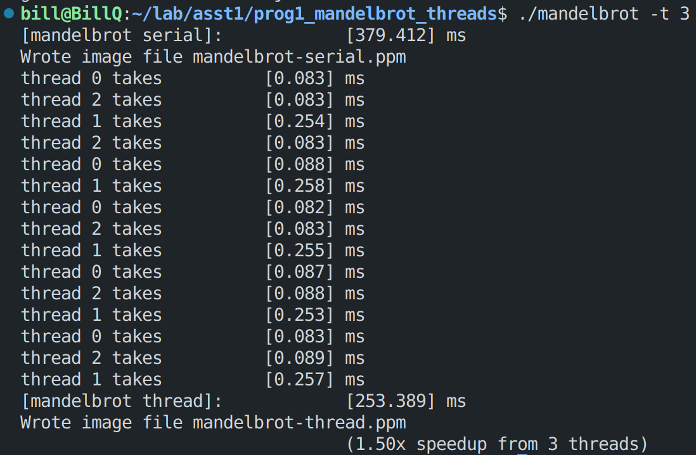

当使用3线程处理图片的时候，发现速度还不如使用2线程，对每个线程执行的时间进行统计，发现当利用3线程处理图片的时候，中间一块的处理时间较长，成为总时间的限制原因。

The background of this research is a fine-grain-thread library, StackThreads/MP. This library adopts the lazy-task creation technique. In StackThreads/MP, idle workers steal tasks from the bottommost stack. 

To reduce the steal overhead, we propose a work stealing strategy that steals some threads from the bottom of a victim's logical stack. This strategy is to control the granularity of stolen threads by aggregating them.

