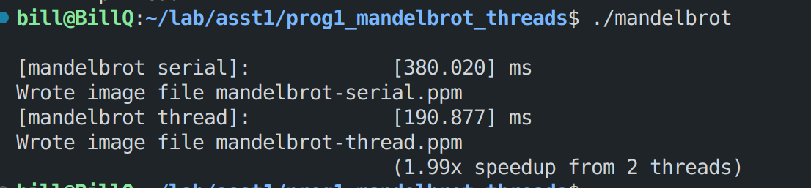

### 实验说明文件

#### Program 1

本实验是利用多线程来加速生成fractal图像。

1. 根据实验指导，将图片切分为上下两个部分，分别交给两个线程并行生成。具体做法就是利用线程号来确定该线程需要生成相应`startRow`和`numRows`的部分的图像。最终的结果如下图所示，利用两个线程使得图片生成的速度提升了1倍。



2. 当分别使用2，3，4，5，6，7，8作为线程数以后，加速比没有和理论上那样与线程数成比例的增长。

   | 线程数 | 加速比 |
   | :----: | :----: |
   |   2    |  1.98  |
   |   3    |  1.63  |
   |   4    |  2.44  |
   |   5    |  2.46  |
   |   6    |  3.22  |
   |   7    |  3.35  |
   |   8    |  3.96  |

   ​	其实原因很容易分析，虽然每个线程是并行的，但是最后合并结果的时候还是要等每个线程结束以后才能合并，也就是说时间的长短取决于需要时间最长的那一个线程。从这里也可以看出，并不是线程数或者核数越多，加速比越高，对于一个已经写好的程序来说，加速比最大值不会超过原总时间/span，span指的是最长的由开始到结尾的，不可并行的任务链的总时间，是由算法决定的。同时，加速比也不会超过线程数或者核数，是由硬件决定的。两者同时影响着并行的效果。

   ​	对于本实验来说，观察图像1，会发现中间的生成任务会高于上下两侧的生成任务，所以当以几何等分图片的时候，生成的时间并不相同，由于中间图片生成的时间最长，所以整个任务的时间取决于中间生成的时间。

3. 对于如何分配才能使得加速比最大，首先想到的是，细化任务然后根据时间的长短，尽量让每个线程得到的任务所需的时间相同，因为本实验中每个部分的生成是独立的，所以最理想的是将消耗总时间/线程数的时间分配给每个线程。所以就手动根据前面的实验结果，将图片分为24个块，再根据大致的时间分配给各个线程，发现最终实验结果远不及7倍，并且还是只能根据特定的这幅图片，所以放弃了这个方法。

   在网上查找static assignment的这个概念的时候无意间看到了work stealing的算法，虽然work stealing好像是用于解决在一个工作链中，产生子任务，然后子任务由其他空闲的线程来执行，这样最大化硬件的使用效率。不过work stealing的思路也可以利用在本任务中，与其手动将任务分配给各个线程，不如让线程主动去取任务，我们需要做的就是将任务细分成较小的块，块越小，最终每个线程执行的时间越相近。

   具体的实现方法就是利用一个公共的任务队列，在每个线程开始的时候，都会首先将分配给自己的任务切分成线程数的子任务，然后放入公共队列中，然后就开始执行公共队列中的任务，直到队列为空，说明所用的任务都已完成。work stealing里面也分为两种调配策略一种就是利用公共队列，另外一种是每个线程都有一个自己的队列，这里用公共队列。

   实验结果：

   | 线程数 | 加速比（view1） | 加速比（view2） |
   | :----: | :-------------: | :-------------: |
   |   2    |      1.99       |      1.74       |
   |   3    |      2.92       |      2.79       |
   |   4    |      3.70       |      3.73       |
   |   5    |      4.81       |      4.75       |
   |   6    |      5.63       |      5.69       |
   |   7    |      6.35       |      6.46       |
   |   8    |      7.25       |      7.17       |


#### Program 2

本实验是利用SIMD来实现向量化的运算。

1. 实现`clampedExpVector()`

   ​	感觉有一个很容易进入的误区，就是如果利用向量化指令时，是对一组数据执行完所有的操作以后，再处理下一次数据，还是按指令的顺序一批一批处理数据，换句话说就是最外层的循环是遍历数据，还是遍历指令，其实很容易分析，一定是遍历数据，对一组数据处理完以后再处理下一组数据。否则会产生大量的中间数据没有地方存储。

   ​	函数的具体实现：

   （1）初始化，需要将result初始化，当value的值为0的时候，将result初始化为0，当value的值为其他值的时候，将result初始化为1（通过调用向量与0的比较的函数即可得到相应的mask）;同时还要初始化一个计数的向量，从0开始，运算完乘法一次就+1，然后再与exponent对比得到新的mask，循环下去。

   （2）循环结束的标志，利用提供的`cs149_cntbits()`可以计数mask中1的个数，当mask全为零时，就说明这组数据计算完成。

   （3）限定大小，也是直接利用大小比较的向量化函数得到mask，然后利用mask来修改result。

   （4）处理无法整除的问题，之前在所有循环的过程中都用到了一个`maskALL`的mask，用它来load和store，在处理到最后一组数据时（判断条件就是剩下的数据是否小于VECTOR_WIDTH），将maskALL改为只有前（N-i）位为1的mask，之后的内容都不需要改变。相当于就没有用到后面的值了。

2. vector利用率分析

| VECTOR_WIDTH | Vector Utilization |
| :----------: | :----------------: |
|      2       |       90.4%        |
|      4       |       88.4%        |
|      8       |       87.4%        |
|      16      |       86.9%        |

可以发现当向量的宽度越大，一次处理越多的数据的时候，向量的利用率会降低。我认为这是因为当同时处理一组数据时，处理的时间是由需要乘法次数最多的数据决定的，当这个需要时间最长的数据结束前，其他向量都会处于空闲状态。而如果一次处理的数据越多，意味着处于空闲状态的向量越多，导致向量的利用率越低。更严谨的解释应该是，向量的利用率=（向量的总时间）/(（每组最大使用时间*宽度）之和)，向量的总时间不会发生变化，但是每组最大使用时间会不同，当宽度较小时，可能一个时间消耗较短的数据也作为当前组时间最长的数据，而那些本身是最大使用时间的数据不会发生变化，这样最终就导致组内数据越少，分母就越小，利用率就越大。

3. 实现`arraySumVector()`

   利用`hadd`和`interleave`两个运算就可以完成

   （1）首先计算的是一个向量内的数据之和，进行一次`hadd`就可以得到一对一对的数据之和，进行一次`interleave`运算就可以将重复的和分开，分别放在前面一半和后面一半，这样我们再算前一半的和就可以，直到进行了log2(VECTOR_WIDTH)以后，第一个数据就是这组数据的和。

   （2）利用第一个位置为1的mask将数据取出然后累加即可算出所有数据的和。


#### Program 3

1. 使用的是8-wide向量化指令，意味着理论上能够达到接近8倍的加速比，但是实际上的加速比只有5.05。我认为这是跟白点的分布有关，由于在一个像素内，白点生成的速度要低于黑点，而SIMD计算的是一组像素的值，里面如果出现了一个白点，其他全是黑点的话，那这些黑点实际上处理的速度却变成和白点一样，因为一组数据的处理取决于时间最长的那个，这就大大降低了加速比，而白点周围的黑点数越少，那么这种情况的影响就越小。换句话说，白点分布的越散，加速比会越低。图二的白点分布更散，加速比也只有4.47。
2. 其实如果没有tasks，就是在单核上使用SIMD，让一组数据同时进行运算，而利用tasks，相当于同时开启了多个这样的程序，同时处理多组数据，理论上的加速比就是原计算比x核数。
3. 为了使tasks的加速比超过32，由于只能修改分成任务的个数，实际上在不考虑切分和合并的开销的情况下，切分的越细越好，这样任务分配的就会越平均。我对tasks的理解是，将任务切分成子任务，进入执行队列，然后又4个核来执行，直到队列为空（也不知道理解的对不对）。所以我分为了160个tasks，这样是最大能分成整数的任务数（如果不整除的话又没有措施的话会导致结果错误），加速比达到了58.57。
4. thread和ISPC tasks的区别：除了操作上和分配上的区别以外，我感觉两者的级别不同，thread感觉属于程序的运行，而tasks感觉就是开启了多个程序，可能后者的开销要更大一些；另外我感觉两者的管理者不同，thread由程序管理，由程序分配，而tasks感觉由操作系统管理，分配在那个核上运行，因此一次不能开启太多个线程，但是可以开启很多个tasks。


#### Program 4

1. 由SIMD导致的加速比是ISPC(no tasks)对应的加速比，由多核导致的加速比是ISPC(tasks)/ISPC(no tasks)

2. 若要使加速比降到最小，和前一个实验的分析一样，当每8个数据中有一个是耗时最长的，其他的都是耗时最短的，这样的加速比就越小，因为这组数据所用的时间由耗时最长的决定，所以设置的数据为，每八个数为一组，第一个为2.99，其他为1.0。这样的结果是使得ISPC(no tasks)的加速比为0.75。而由于这不影响多核的并行加速，tasks的加速比仍有8.43。

3. 另外注意到该实验的数据量巨大，所以访存一定是该实验的瓶颈，当把数据全部改为1的时候，由于需要处理的时间降到很短，这样将访存的影响放到最大，使得ISPC(no tasks)的加速比为1.32，而tasks的加速比为1.59。

4. 若要使加速比达到最大，综合上述的分析，将所有的数都置为2.99，这样访存的影响降到最小，又不存在空闲的问题，此时ISPC(no tasks)的加速比为5.26，tasks的加速比为50.74。（在这里我使用AVX2写的SIMD加速比为6.44）

5. 利用AVX2中的函数实现SIMD向量化求平方根，整体的思路还是原有的函数，具体如注释所示。

   ```c++
   void sqrtAVX2(int N,float startGuess,float* values,float* output)
   {
       __m256 Ofive=_mm256_set1_ps(0.5f);
       __m256 three=_mm256_set1_ps(3.f);
       __m256 minierror=_mm256_set1_ps(0.9999f);//由于没有找到abs浮点操作，就直接改写了误差范围
       __m256 maxerror=_mm256_set1_ps(1.0001f);//同时为了简化循环内的计算，将-1直接计算出来
       __m256 guess,tmp,mask1,mask2,mask,value;
       float judge[8];//用于提取出mask的值，然后判断循环是否继续
       for(int i=0;i<N;i+=8)
       {
           //对应的是求guess和error
           guess=_mm256_set1_ps(startGuess);
           value=_mm256_loadu_ps(values+i);
           tmp=_mm256_mul_ps(guess,value);
           tmp=_mm256_mul_ps(guess,tmp);
           mask1=_mm256_cmp_ps(tmp,maxerror,_CMP_GT_OS);
           mask2=_mm256_cmp_ps(tmp,minierror,_CMP_LT_OS);
           mask=_mm256_or_ps(mask1,mask2);
           _mm256_storeu_ps(judge,mask);
           //之后就是迭代运算直到误差满足要求
                 while(judge[0]||judge[1]||judge[2]||judge[3]||judge[4]||judge[5]||judge[6]||judge[7])//借用了第二个实验的思路，但是AVX2没有提供类似的函数，所以就是直接取出以后再或运算判断是否还有继续的。感觉因为这里的存取消耗了很多的时间，导致加速比不算很高
           {
               tmp=_mm256_sub_ps(three,tmp);
               guess=_mm256_mul_ps(tmp,guess);
               guess=_mm256_mul_ps(Ofive,guess);
   
               tmp=_mm256_mul_ps(guess,value);
               tmp=_mm256_mul_ps(guess,tmp);
               mask1=_mm256_cmp_ps(tmp,maxerror,_CMP_GT_OS);
               mask2=_mm256_cmp_ps(tmp,minierror,_CMP_LT_OS);
               mask=_mm256_or_ps(mask1,mask2);
               _mm256_storeu_ps(judge,mask);
           }
           value=_mm256_mul_ps(guess,value);
           _mm256_storeu_ps(output+i,value);
       }
   }
   ```

   最终对于随机输入的数据，我的加速比为3.37，ISPC的加速比为4.10。


#### Program 5

1. ISPC的加速比为0.99，反而小于不并行，原因是大量的时间源于访存，而可并行计算的时间相对访存来说很小，再加上ISPC自身的开销，导致了这个结果；ISPC(tasks)的加速比为1.12，仍然是因为访存占用了大量的时间。因为在并行的过程中我们处理的都是数据的运算，而不涉及访存，因此仅仅通过改变并行的策略无法大幅度提高加速比。
2. 读取X和Y时，由于相同位置的X,Y,Result在Cache中相冲突，所以相当于每次需要读写的时候都是不命中的。因此读取X,Y时需要2次访问内存的操作，而每次要写入Result时，首先要从内存中将数据调入cache，一次访问，然后再将写后的存入内存（写直法），或者在下一次替换的时候写入内存（写回法），因此总是需要两次访存。所以一次计算对应着4次访存。
